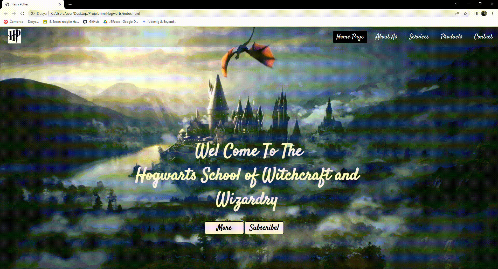

<h1> Wel Come To The Hogwarts School of Witchcraft and Wizardry </h1>

 Hogwarts was founded over a thousand years ago by four powerful wizards: Godric Gryffindor, Salazar Slytherin, Rowena Ravenclaw and Helga Hufflepuff. They chose to split the students into four ‘houses’, each bearing their surnames and featuring young wizards and witches who displayed abilities and personalities they wanted to nurture. 

<h2> Used Technologies </h2>

HTML, CSS  used.

<h2>Screenshot </h2>

